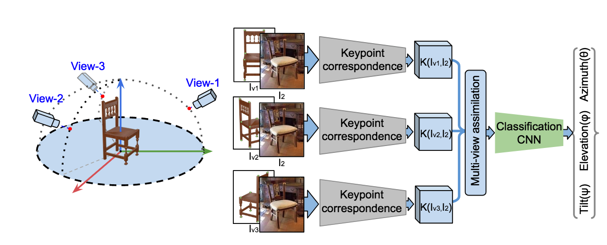

# Network Architecture



This repository contains the code for our work Object Pose Estimation Using Multi-View Keypoint Correspondence, accepted in Geometry Meets Deep Learning Workshop, at ECCV 2018.

# Pose Estimator Network Training

Train this network, after having trained the UCN.
```
# set the following config variables in configs/config.py
ispa_net = False
```

```
# set the following config variables in ispa_net_configs/train_config.py
class_name = any one of 'chair'/'sofa'/'bed'/'diningtable'
train_script = 'multi_view_train.py'
```

```
# set the following config variable in ispa_net_configs/ucn_config.py
dict_models = {'chair': ['path/to/trained/ucn/for_chair', ''],
             'sofa': ['path/to/trained/ucn/for_sofa', ''],
             'bed': ['path/to/trained/ucn/for_bed', ''],
              'diningtable': ['path/to/trained/ucn/for_diningtable', ''],}
```

```
# run the following to train the pose estimator
python main.py

```


# Pose Estimator Hyperparameters
The hyperparameters used, have been set in the folder ispa-net_configs.

_Note: Please look into the comments in thr files of ispa-net_configs for additional information__


# Multi-View Pose Estimator Network Testing

Train this network, after having trained the UCN, and the Viewpoint Classifier Network
```
# set the following config variables in multi_view_configs/test_config.py
class_name = any one of 'chair'/'sofa'/'bed'/'diningtable'
model_to_load = 'path/to/pretrained_model'
```

```
# set the following config variable in multi_view_configs/ucn_config.py
dict_models = {'chair': ['path/to/trained/ucn/for_chair', ''],
             'sofa': ['path/to/trained/ucn/for_sofa', ''],
             'bed': ['path/to/trained/ucn/for_bed', ''],
              'diningtable': ['path/to/trained/ucn/for_diningtable', ''],}
```

```
# run the following to train the pose estimator
python train_test_scripts/iterative_test.py
```

_Note:_
* For Evaluating the model trained on more data(i.e the ones denoted with subscript $_D$, in the paper)
	* use the models in pretrained_weights/multi_view_models/ucns/separate_ucn/*, for the ucn weights
	* use the models in pretrained_weights/multi_view_models/classifiers/*/all_data/, for the pose estimator weights
* For Evaluating the model trained on less data (i.e the ones denoted without subscript $_D$, in the paper)
	* use the models in pretrained_weights/multi_view_models/ucns/combined_ucn/*, for the ucn weights
	* use the models in pretrained_weights/multi_view_models/classifiers/*/less_data/, for the pose estimator weights